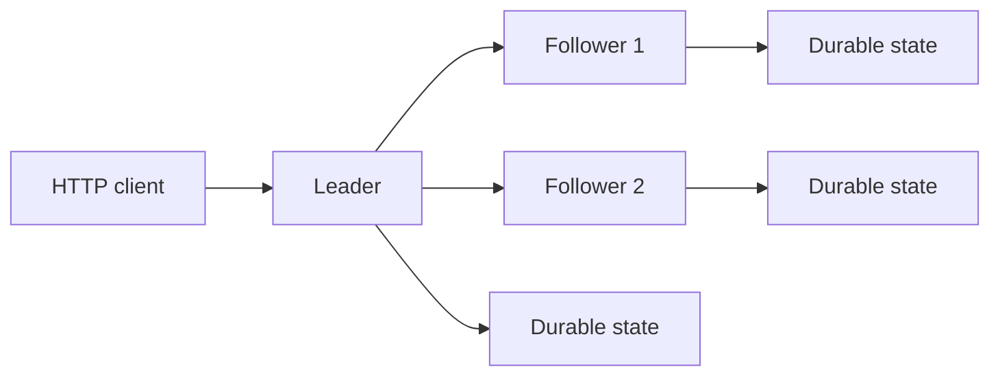

# Fault-Tolerant Distributed Key-Value Store

[](https://github.com/anishmannem963/raft-kv-store/actions/workflows/ci.yml)
[](https://github.com/anishmannem963/raft-kv-store/actions/workflows/benchmark.yml)
[](https://github.com/anishmannem963/raft-kv-store/actions/workflows/fault-matrix.yml)

An educational distributed key-value store implemented in Go. It uses a Raft-style replicated state machine with randomized leader elections, heartbeats, majority-quorum log replication, durable node state, log compaction, snapshot installation, linearizable reads, and idempotent writes.

> This is an educational implementation, not a production database or a complete implementation of every feature in the Raft paper. See [Scope and limitations](docs/architecture.md#scope-and-limitations).

## Architecture



A write is acknowledged only after a majority has replicated it and the leader has durably advanced its commit index. If a follower falls behind the compacted log prefix, the leader installs a state-machine snapshot before sending the remaining suffix.

- [Architecture and safety model](docs/architecture.md)
- [HTTP API](docs/api.md)
- [Benchmark methodology and results](docs/benchmarks.md)
- [Fault-injection methodology and results](docs/fault-testing.md)

## Verified release evidence

- **150,000/150,000 writes committed** across 15 independent 10,000-write runs
- **Zero benchmark failures** and complete commit-index, key-count, and state-hash convergence
- **50/50 fault scenarios passed** across leader crashes, live partitions, durable restarts, and snapshot recovery
- Mean replacement election: **440.5 ms** after a leader crash and **436.3 ms** after leader isolation

Results were measured on GitHub-hosted runners. See the methodology documents for workload details and interpretation limits.

## Run a three-node cluster

```bash
docker compose up --build
```

Find the leader:

```bash
curl -s localhost:8081/status
curl -s localhost:8082/status
curl -s localhost:8083/status
```

Write to the node whose status is `leader`, then perform a linearizable read from that leader:

```bash
curl -X PUT localhost:8081/kv/message \
  -H 'Content-Type: application/json' \
  -H 'X-Client-ID: example-client' \
  -H 'X-Request-ID: request-1' \
  -d '{"value":"hello raft"}'
curl localhost:8081/kv/message
```

A write sent to a follower returns HTTP 307 and includes the current leader address in the JSON response.

`GET /kv/{key}` is linearizable by default: the leader first ensures an entry is committed in its current term, then confirms contact with a majority before serving the value. A follower-local diagnostic read is available explicitly through `GET /kv/{key}?consistency=stale`.

Every write requires `X-Client-ID` and `X-Request-ID`. Retrying the same client/request pair with the same key and value returns success without appending another log entry. Reusing the pair for a different command returns HTTP 409.

## Current guarantees

- One durably persisted vote per server per term, including across restarts
- Log consistency checks using previous log index and term
- A write is applied only after replication to a majority
- A three-node cluster can continue committing with one unavailable follower
- Higher-term RPC responses force a leader or candidate to step down
- Default reads are served only by a leader that confirms a current-term quorum
- Committed client request IDs survive restarts and make write retries idempotent
- Leaders do not start new elections from their own follower election timers

Each Docker node stores its current term, vote, log, and commit index in a separate named volume. Updates use a write-sync-rename-directory-sync sequence so an acknowledged state transition is not left only in process memory. A restarted node rebuilds its key-value state machine from committed log entries.

For a local binary, set `DATA_DIR` to enable file-backed state. Leaving it unset uses in-memory storage, which is useful for tests.

## Test

```bash
go test -race ./...
```

The CI fault-injection test identifies the active leader, commits a value, stops that leader, measures replacement election time, commits through the surviving two-node quorum, restarts the old leader, and verifies that all three nodes converge. The measured `election_ms` value is written to the GitHub Actions job summary.

The partition test keeps the old leader process alive but disconnects it from the cluster network. It verifies that the isolated leader cannot serve a linearizable read, the two-node majority elects a leader and commits, and the healed cluster converges to one leader with identical committed state. Election and healing durations are recorded in the Actions summary.

Run a reproducible write benchmark against a running cluster:

```bash
./scripts/benchmark.sh 10000 16 benchmark-results.json
```

The machine-readable result reports successful and failed writes, throughput, min/p50/p95/p99/max latency, and final cluster convergence. Convergence requires every node to report the same commit index, key count, and deterministic SHA-256 state hash. CI recreates a clean cluster for a bounded 300-write check on each change; the manually dispatched `Benchmark` workflow defaults to 10,000 writes with a 10-minute limit and uploads its JSON result as an artifact.

For repeated measurements across concurrency levels, run:

```bash
./scripts/benchmark-suite.sh 10000 5 "1 8 16" benchmark-suite-results 10m
```

Each repetition uses fresh cluster volumes. The suite preserves every raw run and produces `summary.json` with mean, median, minimum, and maximum throughput plus aggregate p50/p95/p99 latency and convergence totals. The manual GitHub workflow uses these defaults, yielding 15 independent 10,000-write experiments.

Run the complete failure-recovery matrix with:

```bash
./scripts/fault-matrix.sh 15 15 10 10 fault-matrix-results
```

The 50 default scenarios use clean cluster volumes and cover leader process failures, live leader isolation, snapshot recovery for lagging followers, and durable container restarts. Each scenario writes a log and NDJSON record. `summary.json` reports pass rate and per-category recovery, election, and healing durations. Pull requests execute one scenario from every category; merging fault-matrix changes runs the complete suite automatically.

Published performance and reliability claims come only from uploaded GitHub Actions artifacts. The methodology, environment caveats, and latest verified aggregate results are documented in [docs/benchmarks.md](docs/benchmarks.md) and [docs/fault-testing.md](docs/fault-testing.md).

Raft RPCs deliberately use fresh HTTP connections so a Docker network disconnection immediately affects the next quorum check instead of allowing a pooled socket established before isolation to mask the partition.

Committed logs are compacted into snapshots after 100 entries. A snapshot contains the key/value state and request-deduplication records at an absolute log index and term. When a follower falls behind the compacted prefix, the leader installs the snapshot and then streams the remaining log suffix. CI validates this by stopping a follower for 105 writes and requiring it to recover after restart.

## Roadmap

- [x] Leader election and heartbeats
- [x] Replicated `PUT` and local `GET`
- [x] Three-node Docker Compose cluster
- [x] Durable log, commit index, and term/vote persistence
- [x] Linearizable reads and request deduplication
- [x] Snapshotting, log compaction, and lagging-follower installation
- [x] Automated container-restart recovery test
- [x] Automated leader-failure recovery test
- [x] Automated network-partition recovery test
- [x] Reproducible throughput, latency, election, and recovery benchmarks
- [x] Fifty-scenario failure/recovery matrix
- [x] Public architecture, API, methodology, and release documentation

## Contributing

See [CONTRIBUTING.md](CONTRIBUTING.md) for development, testing, and pull-request expectations.

## Releases

Tags matching `v*` build checksum-protected node and benchmark archives for Linux, macOS, and Windows, then attach them to the corresponding GitHub Release. Release history is recorded in [CHANGELOG.md](CHANGELOG.md).
