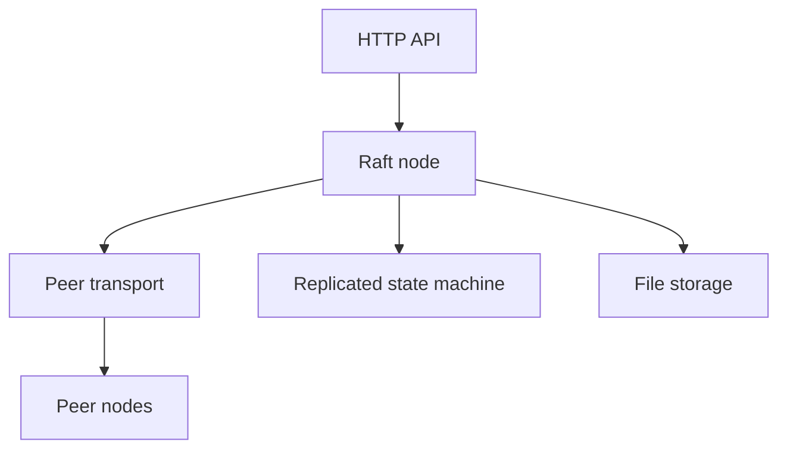

# Architecture and safety model

## Components

Each process owns one `raft.Node`, one key/value state machine, and one storage implementation. The HTTP server exposes client and internal Raft RPC endpoints. The Docker Compose topology starts three fixed members with independent persistent volumes.

## Write path

1. A client sends a `PUT` with a client ID and request ID to the leader.
2. The leader appends and persists the command locally.
3. Replication goroutines send `AppendEntries` to followers.
4. After a majority acknowledges the entry, the leader durably advances its commit index and applies the command.
5. The client receives HTTP 201. A retry with the same identifiers and command does not append a duplicate entry.

Replication is single-flight per leader. This prevents concurrent client writes from racing through shared follower progress bookkeeping.

## Read path

Default reads are leader-only. Before returning a value, the leader ensures that an entry from its current term is committed and confirms contact with a majority. This prevents a stale former leader from serving a successful read after isolation. `?consistency=stale` is an explicit diagnostic escape hatch that reads the local state machine without a quorum check.

## Elections and term changes

Followers use randomized election timeouts. A candidate increments and persists its term and self-vote before requesting votes. A majority elects a leader. Heartbeats reset follower timers, higher-term responses cause step-down, and nodes already in the leader state ignore follower election-timeout events.

## Persistence and recovery

The file storage layer persists the current term, vote, log, commit index, and snapshot using a temporary file, file sync, atomic rename, and directory sync. At startup, a node restores the snapshot and replays committed suffix entries to reconstruct both key/value data and request-deduplication state.

## Snapshots and compaction

After 100 committed entries, a node compacts the committed prefix into a snapshot containing:

- last included absolute index and term;
- the key/value map; and
- applied client/request identifiers.

Log indices remain absolute after compaction. If a follower's next index is behind the snapshot boundary, the leader sends `InstallSnapshot`, then resumes normal suffix replication.

## Safety properties exercised

- one persisted vote per term;
- log matching through previous-index and previous-term checks;
- majority acknowledgement before write success;
- higher-term step-down;
- no quorum-confirmed reads from an isolated old leader;
- state-machine and deduplication recovery after restart;
- snapshot installation for a follower behind the compaction boundary; and
- convergence of commit index, key count, and deterministic state hash.

These properties are covered by race-enabled unit tests and live three-container failure scenarios. They are tested evidence, not a formal proof.

## Scope and limitations

This repository intentionally uses a fixed three-node membership. It does not currently implement joint-consensus membership changes, pre-vote, leadership transfer, read leases, batching, TLS, authentication, authorization, multi-key transactions, watch streams, disk-corruption repair, or formal model checking. The HTTP API and on-disk format are not yet promised to remain stable across major versions.

The project is suitable for learning, testing, and portfolio demonstration. It should not hold production data.
